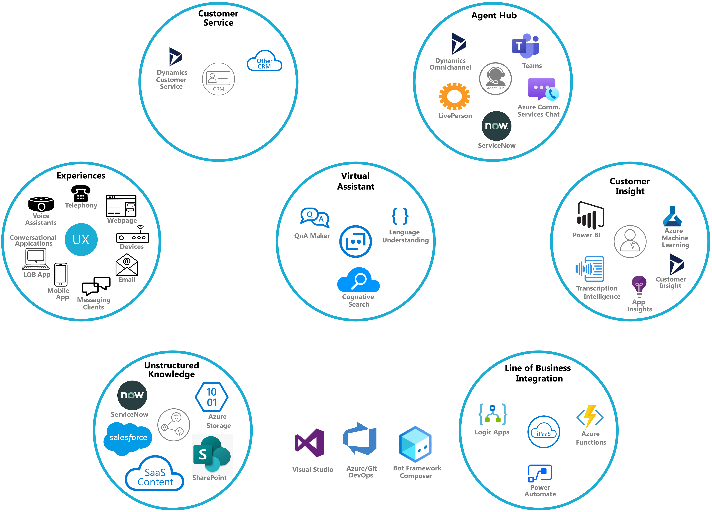

# What is the Contact Center Accelerator

A modern enterprise contact center solution is made up of a number of subsystems and services. Specializing and integrating these
subsystems and services to create a complete and effective contact center can be challenging and takes time and skill. 
The Contact Center Accelerator addresses those challenges by providing a "pre-wired" baseline for a modern enterprise contact
center solution with all its subsystems and services specialized and integrated so it's fit for service right out of the box.
Here's a high-level view of the subsystems and services of this accelerator, the center of which is the virtual assistant you
will extend to create a custom conversational experience that can support every touchpoint in your organization:



## Your Contact Center

You'll use this accelerator to create and deploy a ready-made contact center that integrates all the major features and
services of a modern contact center. The solution generated by this accelerator includes all the source code and
deployment scripts, nothing is hidden or inaccessible. This is an open source solution under the MIT license so you are
free to restructure, modify, extend, and reuse as you see fit. The ultimate goal of this accelerator is to serve as
baseline and roadmap that can be use as a starting point for an enterprise call center that can be customized and
extended quickly without having to first master each of the various disciplines and technologies integrated into this
solution. The deployment script included in this accelerator makes it extremely easy to get the solution up and running
so you can get hands-on and explore the value of the baseline, and later, dive into the technical details.

## Azure resource deployment

A comprehensive and effective contact center involves the integration of the following Azure resources:

- Azure Bot
- Language Understanding (LUIS)
- QnA Maker Managed
- QnA Maker Azure Search Service
- Azure Communication Service
- Event Grid
- Web Pub Sub
- Azure Function App
- Azure Storage
- Azure Cosmos DB
- Azure App Service Plan
- Azure Application Insights
- Content Moderator (optional)

The deploy can be found in the [Getting Started](#GettingStarted)

### <a name="Prerequisites"></a>Prerequisites

#### Ngrok
To install ngrok, follow instructions [here](https://ngrok.com/download)

#### Azure CLI
The deployment scripts require Azure CLI version 2.22.0 or newer which you can install from [here](
https://docs.microsoft.com/en-us/cli/azure/install-azure-cli-windows?tabs=azure-cli).

#### Azure Communication Service CLI Extension

To install the Azure Communication Service extension, run the following from a command prompt:
```
az communication create
```
#### Web PubSub CLI Extension
To install the Web PubSub extension, run the following from a command prompt
```
az webpubsub
```
Note - The output of this command may be messy with a lot of diagnostics before it prompts to
install the extension so be aware of that.

#### Azure Functions Core Tools
The core agent hub logic lives in a set APIs in the ACSAgentHub Azure Function project and to quickly
test things out you can run it locally from the command line but you'll need to have the Azure 
Functions Core Tools v3.X installed.  Alternatively, you can avoid installing the Azure Functions Core
Tools if you use Visual Studio to run the ACSAgentHub Azure Function project.

To install Azure Function Core Tools v3.X you'll need to download and run the Core Tools installer, based on your version of Windows:

* [v3.x - Windows 64-bit](https://go.microsoft.com/fwlink/?linkid=2135274)
* [v3.x - Windows 32-bit](https://go.microsoft.com/fwlink/?linkid=2135275)

#### Install Bot Framework Composer
The ACS Agent Hub works with any kind of bot built on the Microsoft Conversational AI platform (PVA, Composer, 
Virtual Assistant Template, or SDK bot) but the quickest and easyiest way to get up and running is to use the
Composer sample included in this solution and to do that you'll need to install the Bot Framework Composer
[here](https://docs.microsoft.com/en-us/composer/install-composer?tabs=windows)

### <a name="GettingStarted"></a>Getting Started

Getting started couldn't be easier.  Simply clone the repo and run a deployment script and you're ready
to run the sample app and try out all the escalation scenarios shown in this [demo video](http://add-demo-here).
The deployment script does require that you've taking care of the [prerequisites](#Prerequisites) or it will fail.

1) **Clone the Contact Center Repo**  
Open PowerShell and run the following command:
```
git clone https://github.com/managedcoder/ContactCenter
```
2) **Deploy ACS Agent Hub**  
In PowerShell, change the current directory to the root solution folder (i.e., the one
that contains the ACSAgentHub.sln file). Then run the following script to deploy and
configure all the services required by the ACS Agent Hub:
```
.\Deployment\Scripts\deploy_and_configure.ps1 -hubName <hub name> -resourceGroup <resource group> -location <location name> -NuGetFullPath <nuget path>
```
where:
- **\<hub name>** is the name of your agent hub which will used in creating the various
required services
- **\<resource group>** is the name of the resource group that services will be deployed to
- **\<location name>** is the Azure location name of the region that services will be deployed in
- **\<nuget path>** is the full path to the nuget.exe (e.g., c:\nuget\nuget.exe)

### <a name="ExploreEscalationScenarios"></a>Explore Contact Center Assistant
When the deployment script is finish you're ready to explore the baseline capabilities built into the Contact Center
Assistant.  is to open the Bot Framework Composer and select the **Open** link on
the Home tab and open the ComposerExample that's in the root folder of the solution. This is a very simple bot with 
an Escalate trigger that you can look at to see how to code an escalation and then try it out by using the 
**Start bot** command.  After the bot starts, choose the **Open Web Chat** option in the flyout menu that appears
when the bot finishes it's startup processing.  Type, _**talk to human**_ to start an escalation experience.  There's
a short [demo video](http://add-demo-here) you can watch that shows all these steps and various escalation and agent
management scenaios you can replicate using this sample app.