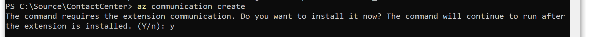
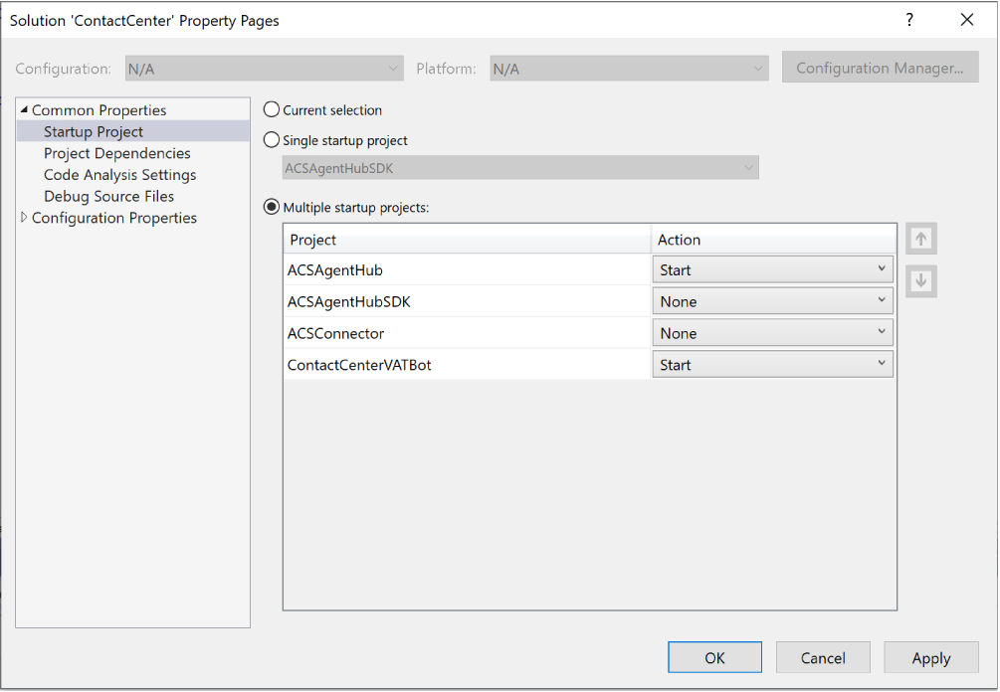
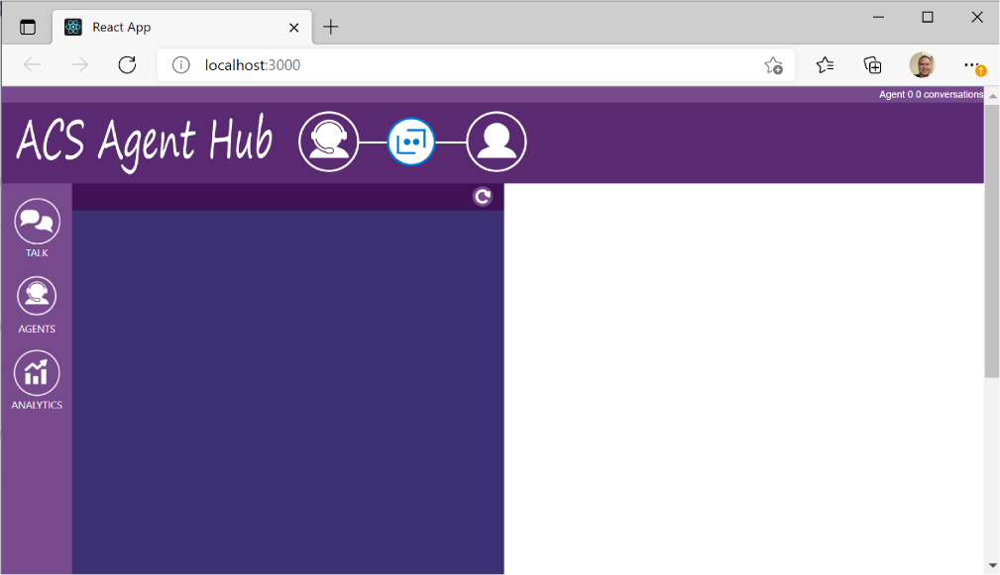
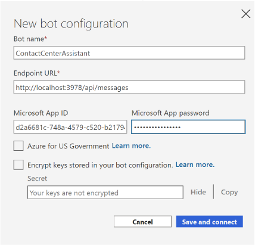

# What is the Contact Center Accelerator

A modern enterprise contact center solution is made up of a number of subsystems and services. Specializing and integrating these
subsystems and services to create a complete and effective contact center can be challenging and takes time and special skills. 
The Contact Center Accelerator addresses those challenges by providing a "pre-wired" baseline for a modern enterprise contact
center solution with all its subsystems and services specialized and integrated so it's fit for service right out of the box.
Here's a high-level view of the subsystems and services of this accelerator, the center of which is the virtual assistant you
will extend to create a custom conversational experience that can support every touchpoint in your organization:


## Your Contact Center

You'll use this accelerator to create and deploy an fully integrated contact center that's been organized and designed 
with the latest thinking on how a modern contact center should be structured. The solution 
generated by this accelerator includes all the source code and deployment scripts, nothing is hidden or 
inaccessible. You are free to restructure or recode as necessary but bear in mind that the accelerator has
expected configuration and file structure that must be respected.

## Azure resource deployment

A comprehensive and effective contact center involves the integration of the following Azure resources:

- Azure Bot
- Language Understanding (LUIS)
- QnA Maker Managed
- QnA Maker Azure Search Service
- Azure Communication Service
- Event Grid
- Web Pub Sub
- Azure Function App
- Azure Storage
- Azure Cosmos DB
- Azure App Service Plan
- Azure Application Insights
- Content Moderator (optional)

The primary objective of this accelerator is to go from zero to a functioning contact center baseline with
minimal developer effort.  The accelerator includes a PowerShell script that automatically deploys and 
configures the above services and the instructions for how to use it can be found in the [Getting Started](#GettingStarted)

### <a name="Prerequisites"></a>Prerequisites

##### Ngrok
Need to install ngrok

##### Azure CLI
The deployment scripts require Azure CLI version 2.22.0 or newer (go [here](
https://docs.microsoft.com/en-us/cli/azure/install-azure-cli-windows?tabs=azure-cli) to install the latest Azure CLI).

##### Azure CLI Extensions
You will need to insall a few CLI extension that are used by the deployment scripts.

###### Azure Communication Service

To install the Azure Communication Service extension, type the ```az communication create``` command in a PowerShell command
window and the extension will prompt you to automatically install itself if its not currently installed.



###### Web PubSub
To install the Web PubSub extension, type the ```az webpubsub``` command in a PowerShell command window
and the extension will prompt you to automatically install itself if its not currently installed. The output
of this command may be messy with a lot of diagnostics before it prompts to install the extension so be aware of that.


## <a name="GettingStarted"></a>Getting Started

After taking care of the [prerequisites](#Prerequisites), do the following:

1) **Deploy Bot**  
Open PowerShell and change the current directory to the VATemplateExample project folder (i.e., the one that contains the 
VATemplateExample.csproj file).  The Run the deploy.ps1 script using the following relative path:<br><br>```.\Deployment\Scripts\deploy.ps1 -name <name of bot> -location <region> -appPassword <password> -createLuisAuthoring -luisAuthoringRegion westus```  <br/><br/>This script deploys and configures all the services required by the virtual assistant.  The name of the bot must be 
Internet-unique and the location is a region name line **eastus** and the password must be 16 characters long and the
-luisAuthoringRegion parameter must be **westus** for US deployments.

2) **Deploy ACS Agent Hub**  
Open PowerShell and change the current directory to the root solution folder (i.e., the one that contains the ContactCenter.sln 
file).  The Run the deploy.ps1 script using the following relative path: <br/><br/>```.\Deployment\Scripts\deploy_acs_agent_hub.ps1 -botName <name of bot> -location <region>```  <br/><br/>This script deploys and configures all the services required by the agent hub.

3) **Start bot and Agent Hub Service**  
In VS, right-click **Solution** in the Solution Explorer and select **Properties**. Select **Startup** tab in left nav and
then click the **Select multiple projects** radio button and set the **Action** to **Start** for ACSAgentHub and 
ContactCenterVABot propjects and then launch the debugger (F5)<br><br>


4) **Create Agent**  
In the PowerShell window you opened, create an agent in Azure Storage by running the Curl command below. You'll need to add at least one agent to be able to sign in to the agent-portal.<br><br>
**Note:** The syntax for the version of Curl that distributes with Windows requires special quoting that would need to
be modified to run this with a non-Windows version of Curl
```
   curl -X POST http://localhost:7071/api/agents `
     -H "Content-Type:application/json" `
     -d '{
       \"id\": \"1\",
       \"name\": \"Agent 1\",
       \"status\": 1,
       \"skills\": [ \"skill 1\", \"skill 2\", \"skill 3\" ] 
     }'
```
5) **Create Tunnel to Agent Hub**  
Open a Command Prompt and run the following command to create a tunnel for use later when you subscribe message events:<br><br>```c:\ngrok\ngrok http 7071 -host-header=localhost:7071```<br><br>
**Note:** You'll want to open a separate Command Promt for this since the ngrok command does not return since it's tied 
up listening for endpoint traffic.  The endpoint that ngrok exposes will be live and accessible as long as that Command 
Prompt is open.

6) **Subscribe to ACS Message Event**  
Open PowerShell and change the current directory to the root project folder (i.e., the one that contains the
ContactCenter.sln file.  Run the following script and pass the ngrok endpoint (the https version) to have Event Grid 
call the bot's messaging webhook when agents chat<br><br>
```.\Deployment\Scripts\update_webhook.ps1 -botName <bot name> -endpoint "https://<############>.ngrok.io/api/agenthub/messagewebhook"```<br><br>
Where \<bot name\> is the same name you passed as the **-name** parameter earlier when you ran  the deploy.ps1 script.

7) **Install npm Packages**  
Open a new command prompt window and from the agent-portal's project folder (the one that contains package.json), run the following command:<br><br>
```npm install```

8) **Launch Agent-Portal**  
In the command prompt window you opened in the previous step, run the following command:<br><br>
```npm start```<br><br>
It will take a minute or two for npm to build the agent-portal and start it in the browser but when it does you'll be able to sign 
in as one of the agents in the list.  Once you've successfully signed in you'll see an empty list of conversations and the window 
will look something like this:<br><br>


9) **Launch Bot Emulator and Escalate to Agent**  
Launch bot emulator and select **File | New Bot Configuration** and enter a name for the emulator profile then enter
http://localhost:3978/api/messages in the **Endpoint URL** field.  You'll also need to enter the **Microsoft App ID** and **password** 
from the appsettings.json file in the root folder for the VATemplateExample project. When you've entered those values, click the
**Save and connect** button and, for convience, save the profile in the VATemplateExample's project folder (it's gitignored).<br><br>
<br><br>
After you've successfully launched the bot emulator and you've seen the Welcome prompt, type the following into the bot emulator's 
message field:<br><br>```talk to human```<br><br>
Follow the conversational prompts to escalate conversation.

10) **Accept the Escalation**  
After you have successfully escalated to an agent in the bot emulator, switch to agent portal and click the green answer button to
accept the escalation request and take ownership of the conversation.

11) **Chat Back and Forth**  
Type messages in the agent-portal and the bot emulator and when finished click the hangup button
